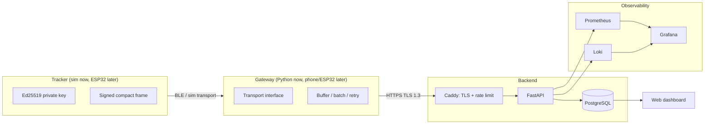

# SecureTrack

**A DIY, security-first asset-tracking platform: simulated today, ESP32/BLE tomorrow.**

-blue)


SecureTrack is an open-source learning project that builds a personal asset tracker end to end:
device, gateway, API, database, dashboard, monitoring, CI/CD, and cloud infrastructure.
Every component is designed with security as the primary constraint, and every major decision
is documented as an ADR and threat-modeled.

> **No hardware needed.** Phase 1 to 7 run entirely on a simulator. The real ESP32 plugs in later
> through the same *wire contract* and *transport interface*, so the backend never changes.

---

## Why this project exists

I'm building toward a Cybersecurity / Cloud / DevOps career. SecureTrack is a vehicle for practising:

| Domain | Where it shows up |
|---|---|
| Networking and BLE | Simulated radio with MTU limits, packet loss, duplication, reordering |
| Applied cryptography | Per-device Ed25519 identity, signed frames, replay protection |
| Secure provisioning | One-time tokens, key registration, revocation |
| API security | JWT auth, scoped gateway tokens, rate limiting, input validation |
| DevSecOps | Docker, GitHub Actions, SAST, dependency/container/secret scanning |
| Cloud and IaC | Terraform, managed Postgres, secrets manager, real TLS |
| Observability | Prometheus, Grafana, structured logs, alerting |
| Incident response | Scripted attack drills with written post-mortems |
| Threat modeling | STRIDE, trust boundaries, risk-ranked, updated every phase |

## Scope: what SecureTrack is (and isn't)

An Apple AirTag has no GPS and no internet. It broadcasts a rotating BLE identifier, nearby phones
relay it, and only the owner can decrypt the location. SecureTrack's **core** is a *gateway-based
tracker*: a device reports signed telemetry through a gateway to a backend. An AirTag-style
**finder network** with rotating IDs and end-to-end encrypted location is the **stretch goal**
(Phase 9), because it is the best privacy-engineering exercise in the project.

## Architecture



**Three separate identities** so one compromise doesn't become total compromise:

| Identity | Credential | Can do | Cannot do |
|---|---|---|---|
| User | Argon2 password + short-lived JWT | Manage own devices, view history | Forge telemetry |
| Gateway | Scoped, revocable token | Submit telemetry batches | Forge device signatures, read history |
| Device | Ed25519 keypair (private key never leaves it) | Sign its own frames | Authenticate to the API directly |

## Security design highlights

- **Server stores public keys only.** A database leak does not let an attacker impersonate devices.
- **Replay defence in three layers:** monotonic counter, timestamp window, `(device_id, counter)` dedupe.
- **Compact binary wire format** that respects real BLE size limits, so the simulator can't cheat. See [`docs/WIRE_CONTRACT.md`](docs/WIRE_CONTRACT.md).
- **Full device lifecycle:** `unprovisioned → active → suspended → revoked`, with every transition audit-logged.
- **Security gates in CI:** secret scan, SAST, dependency audit, container scan.

## Quick start

> Coming with Phase 4 (`docker compose up`). For now, follow [`docs/PHASE0_SETUP.md`](docs/PHASE0_SETUP.md)
> to prepare the development environment.

## Repository layout

```text
securetrack/
├── device/      # simulator now, ESP32 firmware later
├── gateway/     # transport interface + uplink to API
├── backend/     # FastAPI app, migrations, tests
├── dashboard/   # web UI
├── infra/       # docker-compose, terraform, prometheus, grafana
├── docs/        # architecture, threat model, wire contract, ADRs, incident reports
├── scripts/     # attack and test scenarios
└── .github/workflows/
```

## Documentation

| Doc | Purpose |
|---|---|
| [`ROADMAP.md`](ROADMAP.md) | Phases, deliverables, exit criteria |
| [`docs/THREAT_MODEL.md`](docs/THREAT_MODEL.md) | Assets, trust boundaries, STRIDE, risk ranking |
| [`docs/WIRE_CONTRACT.md`](docs/WIRE_CONTRACT.md) | Binary frame spec shared by simulator and firmware |
| [`docs/PHASE0_SETUP.md`](docs/PHASE0_SETUP.md) | Dev environment, repo hygiene, first commit |
| [`docs/adr/`](docs/adr/) | Architecture Decision Records |
| [`docs/incidents/`](docs/incidents/) | Incident drill write-ups |

## Known limitations (honest section)

- Simulation cannot reproduce real radio behaviour (interference, RSSI variance, OS BLE quirks).
- Location in Phase 1 is simulated. Real ESP32 boards have no GPS, so real location will come from
  the gateway's position or an optional GPS module.
- This is a learning project. It has not been independently audited. Do not rely on it to protect
  anything valuable.

## Ethical use

Trackers can be misused for stalking. SecureTrack is for tracking **your own property** only.
Anti-stalking behaviour (unknown-tracker alerts, rotating identifiers) is part of the design
discussion, not an afterthought. See the threat model.

## License

MIT. See `LICENSE`.
