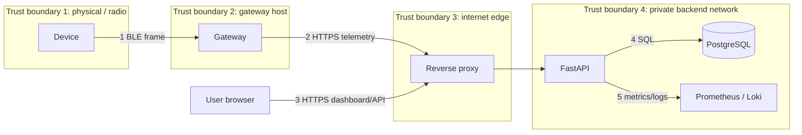

# SecureTrack Threat Model v1

*Method: STRIDE over a data-flow diagram, risk-ranked by likelihood × impact. Living document:
update at the end of every phase. Last reviewed: Phase 0.*

## 1. Scope and assumptions

**In scope:** device (sim/ESP32), gateway, API, database, dashboard, CI/CD pipeline, cloud deployment.
**Out of scope (v1):** physical lab attacks on the chip (glitching, decapping), nation-state adversaries, supply-chain attacks on the hardware vendor.
**Assumptions:** a personal deployment with a few users; the owner's workstation is trusted; TLS terminates at the reverse proxy.

## 2. Assets

| ID | Asset | Why it matters |
|---|---|---|
| A1 | Location history | Privacy; reveals home, routine, travel |
| A2 | Device private key | Impersonating a device |
| A3 | User credentials / sessions | Account takeover |
| A4 | Gateway tokens | Injecting data, DoS |
| A5 | Provisioning tokens | Claiming a device |
| A6 | Audit log | Accountability, forensics |
| A7 | CI/CD secrets and cloud credentials | Full infrastructure compromise |
| A8 | Service availability | Alerts must arrive when an asset moves |

## 3. Actors

| Actor | Capability |
|---|---|
| Remote anonymous attacker | Reaches public HTTPS endpoints |
| Malicious registered user | Valid account, probes for authorization flaws |
| Nearby BLE attacker | Sniffs, replays, jams, spoofs radio frames |
| Compromised gateway | Holds a valid gateway token |
| Insider / stolen laptop | Access to repo, `.env` files |
| Stalker | Plants a tracker on a *person* (abuse case) |

## 4. Data-flow diagram and trust boundaries

Every arrow crossing a boundary needs: authentication, integrity, input validation, and logging.

## 5. STRIDE analysis

| ID | Cat. | Threat | Target | Mitigation | Test / detection |
|---|---|---|---|---|---|
| T1 | S | Fake device sends false location | Flow 1,2 | Ed25519 signature, device registry | Unsigned/wrong-key frames rejected; counter `rejects{reason="bad_sig"}` |
| T2 | S | Attacker claims a device during provisioning | A5 | One-time hashed token, short TTL, owner binding | Token reuse/expiry tests |
| T3 | S | Credential stuffing on login | A3 | Argon2, rate limit, lockout/backoff, breach-password check (later) | Drill 3; failed-login panel |
| T4 | T | Frame modified in transit | Flow 1,2 | Signature over all fields; TLS | Bit-flip test |
| T5 | T | Compromised gateway edits decoded JSON | Flow 2 | Backend verifies original frame bytes only | Mutated JSON, valid frame test |
| T6 | R | Owner denies revoking a device | A6 | Append-only audit log with actor, IP, result | DB role has no UPDATE/DELETE on audit |
| T7 | I | IDOR: user reads another's devices | A1 | Ownership check in every query; deny by default | Automated cross-user tests |
| T8 | I | Secrets or locations in logs | A1, A2 | Log scrubbing, structured logging review | CI grep + unit test |
| T9 | I | DB dump leaked | A1 | Public keys only (no device secrets); hashed tokens; encryption at rest | Review of schema |
| T10 | I | Location of a person exposed by a planted tracker | A1 | Phase 9: rotating IDs, unknown-tracker alerts | Simulation |
| T11 | D | Flooding `/telemetry` | A8 | Proxy rate limit, body size cap, batch cap, backpressure | Load test, 429 metrics |
| T12 | D | BLE jamming | A8 | Not preventable in software; detect heartbeat gap | Drill 4 |
| T13 | E | Gateway token used on admin routes | A4 | Scoped tokens, route-level role checks | Authz matrix tests |
| T14 | E | SQL injection / mass assignment | A1 | ORM + parameterized queries, strict Pydantic schemas | ZAP, Schemathesis |
| T15 | — | **Replay** of captured valid frames | Flow 1,2 | Counter + timestamp window + dedupe | Drill 1 |
| T16 | I | Stolen device key extracted from flash | A2 | ESP32 flash encryption + secure boot (Phase 8); revoke on loss | Documented residual risk |
| T17 | E | Leaked CI/cloud credentials | A7 | OIDC federation instead of long-lived keys, gitleaks, least-privilege IAM | Secret-scan gate |
| T18 | T | Vulnerable dependency / base image | All | pip-audit, Trivy, pinned versions, Dependabot | CI gate |

## 6. Risk ranking (initial, before mitigation)

Scale 1 (low) to 5 (high). Risk = Likelihood × Impact.

| Rank | Threat | L | I | Risk |
|---|---|---|---|---|
| 1 | T7 IDOR | 4 | 5 | 20 |
| 2 | T17 Leaked CI/cloud creds | 3 | 5 | 15 |
| 3 | T3 Credential stuffing | 4 | 3 | 12 |
| 3 | T15 Replay | 4 | 3 | 12 |
| 5 | T1 Fake device | 3 | 4 | 12 |
| 6 | T11 Flooding | 4 | 3 | 12 |
| 7 | T8 Secrets/locations in logs | 3 | 4 | 12 |
| 8 | T2 Provisioning takeover | 2 | 5 | 10 |
| 9 | T16 Key extraction | 2 | 4 | 8 |

## 7. Residual risks accepted for v1

- BLE jamming and physical device theft cannot be solved in software.
- A device whose key is extracted stays trusted until the owner revokes it.
- Single-region, single-instance deployment: no high-availability guarantees.

## 8. Review log

| Date | Phase | Change |
|---|---|---|
| 2026-10-04 | 0 | v1 created |
